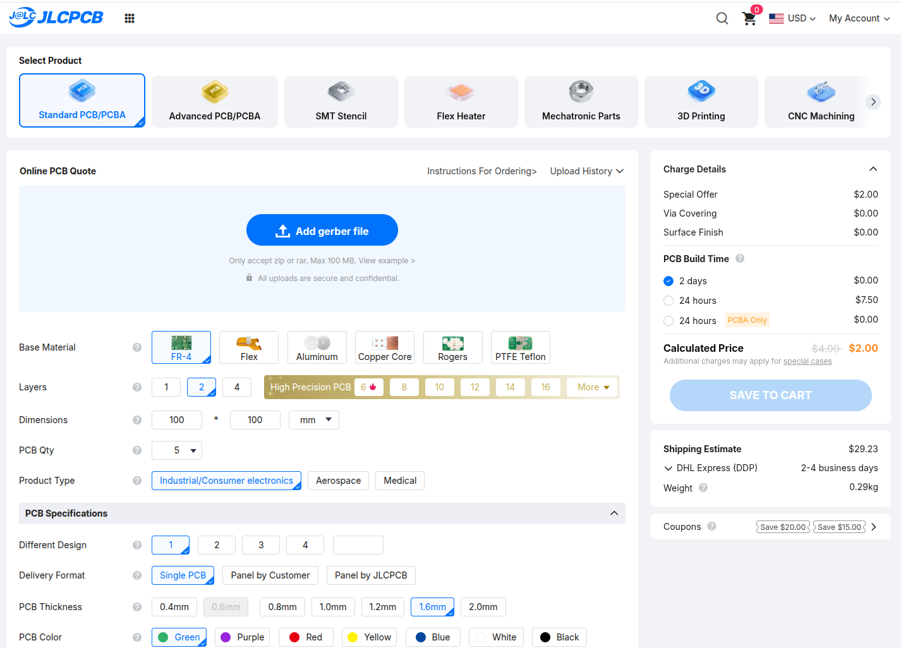
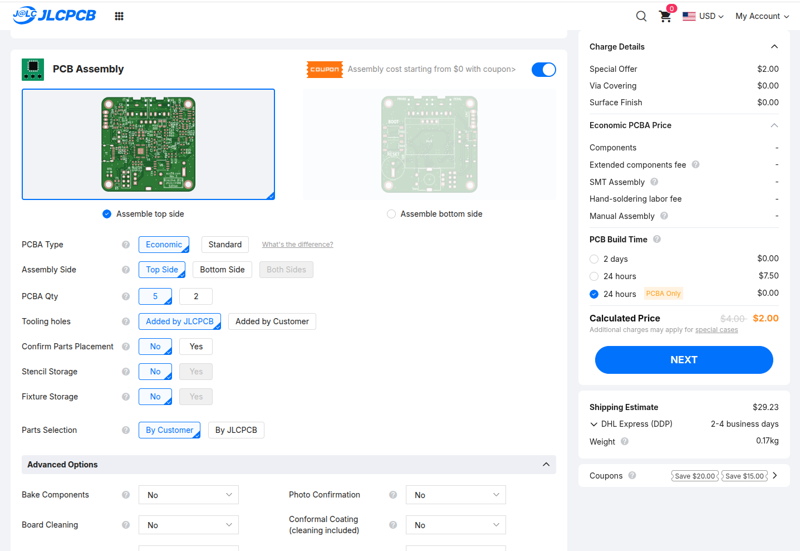
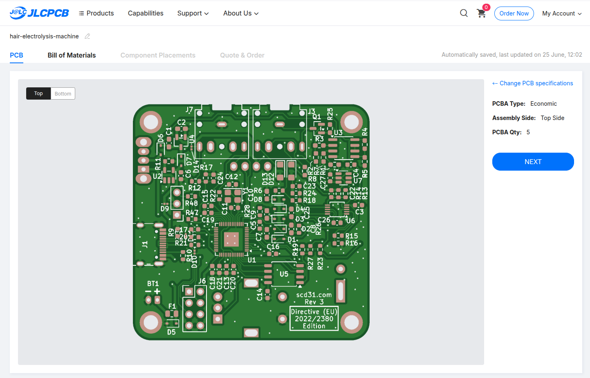
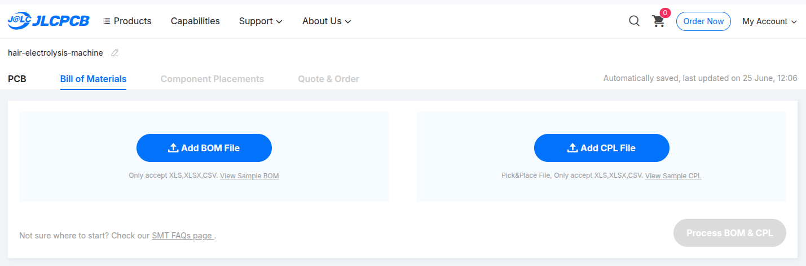
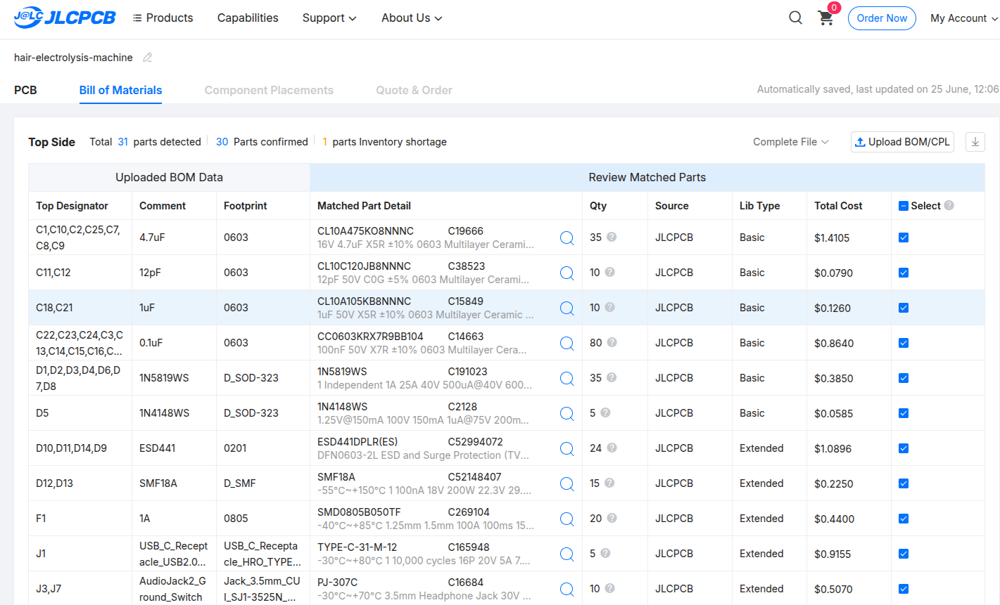
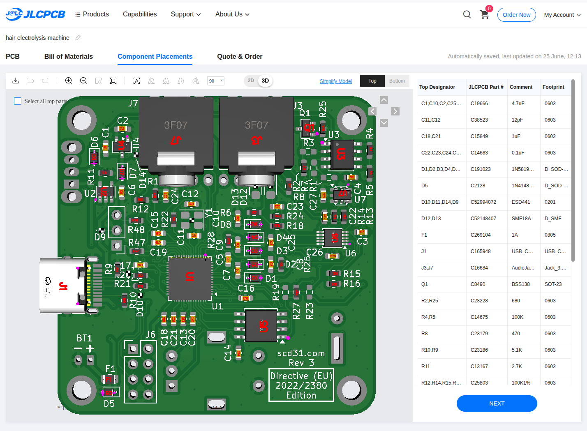
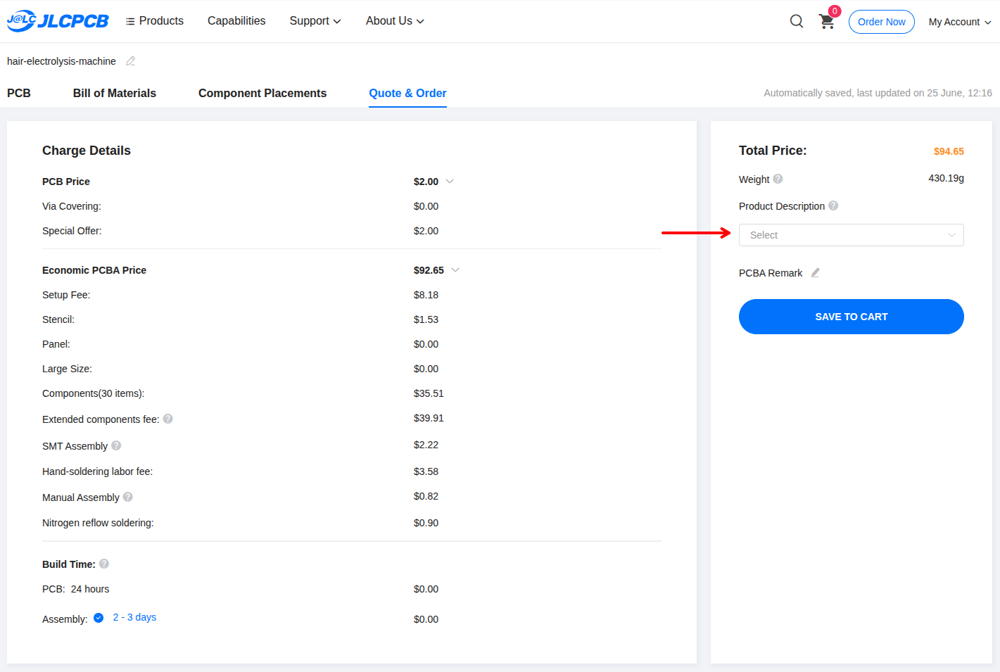
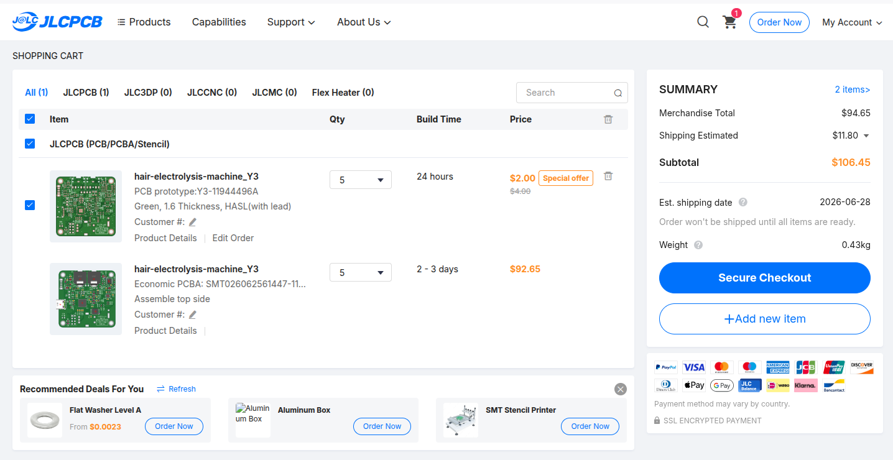

# Von KiCad zu fertigen Platinen (PCB & PCBA)

In diesem Kapitel lernst du, wie du aus den Open-Source-Design-Dateien fertige Platinen bestellst – auch ohne Elektronik-Studium!

**Zielgruppe:** Laien, die noch nie eine Platine bestellt haben.

**Dauer:** Ca. 1–2 Stunden (plus Lieferzeit).

---

## 1. Das Problem: Was ist eine `.kicad_pcb`-Datei?

Ein Fork wie [zoemaestra](https://github.com/zoemaestra/hair-electrolysis-machine-usb-c) enthält verschiedene Dateitypen. Die wichtigsten sind:

- `hair-electrolysis-machine.kicad_pro` (Projekt-Datei)
- `hair-electrolysis-machine.kicad_pcb` (Platinen-Layout)

**Aber:** Eine Leiterplattenfabrik (z.B. JLCPCB) kann mit diesen Dateien nichts anfangen. Sie braucht **Maschinencode** (Gerber-Dateien, BOM, CPL).

**Lösung:** Wie du aus den Design-Dateien fertige Fertigungsdaten machst, erklären die nächsten Abschnitte – mit oder ohne KiCad, je nachdem welchen Fork du wählst.

---

## 2. Option A: Fertige Releases nutzen (Empfohlen für Laien) 🎯

**Zoemaestra** stellt auf der [Releases-Seite](https://github.com/zoemaestra/hair-electrolysis-machine-usb-c/releases) bereits fertige Fertigungsdateien bereit. Du brauchst **kein KiCad** und **kein Plugin**!

### 2.1 Alles auf einmal herunterladen

Bevor du loslegst, lade **alle** benötigten Dateien in einem Durchgang herunter:

**① Release-Assets (für JLCPCB-Bestellung):**

Gehe auf [github.com/zoemaestra/hair-electrolysis-machine-usb-c/releases](https://github.com/zoemaestra/hair-electrolysis-machine-usb-c/releases)
und lade **vom neuesten Release (v3.3)** diese drei Dateien herunter:

- **`hair-electrolysis-machine.zip`** – Die Gerber-Daten (Leiterbahnen, Bohrlöcher, etc.).
  Diese ZIP wird später bei JLCPCB unter "Add Gerber File" hochgeladen.
- **`bom.xls`** – Die Stückliste für JLCPCB (die von zoemaestra selbst getestete Version,
  mit Teilen, die garantiert auf Lager sind). Nicht mit `bom.csv` verwechseln!
- **`positions.csv`** – Die Bestückungskoordinaten (CPL), damit der Roboter weiß,
  wo welches Bauteil hinkommt.

!!! warning "Alle drei Dateien werden für PCBA gebraucht"
    Für die automatische Bestückung (PCBA) brauchst du **Gerber-ZIP + BOM + CPL**.
    Nur die Gerber-ZIP reicht für die leere Platine, aber ohne BOM und CPL kann JLCPCB
    die Bauteile nicht bestücken.

**② Repo-Inhalte (für 3D-Druck und Modding):**

Du brauchst später auch die STL-Dateien für das Gehäuse und den Nadelstift.
Lade daher das **komplette Repository** herunter:

1. Gehe zurück zur [Repo-Startseite](https://github.com/zoemaestra/hair-electrolysis-machine-usb-c).
2. Klicke auf den grünen **"Code"**-Button → **"Download ZIP"**.
3. Entpacke die ZIP – du erhältst alle KiCad-Quelldateien und den Ordner `3dprint/`
   mit den STLs (`case.stl`, `knob.stl`, `pen-Body.stl`, `pen-Cap.stl`).

!!! tip "Warum das Repo als ZIP?"
    Die Release-Assets enthalten nur die Fertigungsdaten für JLCPCB. Die 3D-Druck-Dateien
    (`3dprint/`) und die KiCad-Quellen (`hair-electrolysis-machine.kicad_pcb`) sind **nicht**
    im Release, sondern nur im Repository selbst. Ein Klick auf "Download ZIP" reicht –
    kein Git nötig.

### 2.2 Fertigungsdaten bei JLCPCB hochladen

Wenn du die drei Release-Dateien heruntergeladen hast, geht's weiter mit
[Abschnitt 6: Bei JLCPCB bestellen](#6-bei-jlcpcb-bestellen-schritt-fur-schritt).

**Was du wo hochlädst:**

| Datei | Wohin bei JLCPCB |
|-------|-------------------|
| `hair-electrolysis-machine.zip` | "Add Gerber File" (Schritt 6.2) |
| `bom.xls` | BOM-Upload (Schritt 6.3 – PCBA) |
| `positions.csv` | CPL-Upload (Schritt 6.3 – PCBA) |

**Vorteil:** Keine Software-Installation, keine Versionkonflikte, keine Fehlerquellen.

---

## 3. Optional: Option B: KiCad & Plugin (Für andere Forks oder Eigenbau)

Falls du einen anderen Fork nutzt (annaaurora, scd31, KibbieKatt) oder das Design selbst ändern willst, brauchst du KiCad.

!!! tip "Silkscreen anpassen?"
    Wenn du die Platine personalisieren willst (eigene Beschriftung, Logo entfernen), schau ins Kapitel [Platinenaufdrucke anpassen (Silkscreen)](modding.md).

### 3.1 KiCad installieren (Version beachten!)

1. Lade dir **KiCad** herunter: [kicad.org/download](https://www.kicad.org/download/).
2. **Version beachten:**

    - **Zoemaestra** (USB-C Fork) → **KiCad 9.x** (laut PCB-Datei: `generator_version "9.0"`)
    - **Annaaurora / scd31 / KibbieKatt** → **KiCad 10.x** (alle `generator_version "10.0"`)

3. **Empfehlung:** Installiere exakt die passende Version, um Inkompatibilitäten zu vermeiden.
4. Installiere es (Windows: `.exe`, Mac: `.dmg`, Linux: über Paketmanager).
5. **Dauer:** Ca. 10–15 Minuten (großes Programm).

### 3.2 Das Projekt herunterladen

**Option A: Für Laien (einfach)**

1. Gehe auf die Repo-Seite deines gewählten Forks.
2. Klicke auf den grünen Button **"Code"** → **"Download ZIP"**.
3. Entpacke die ZIP-Datei.

**Option B: Für Fortgeschrittene (Git)**

1. `git clone <repo-url>` (z.B. für annaaurora: `https://codeberg.org/annaaurora/hair-electrolysis-machine-hardware.git`)
2. **Vorteil:** Du kannst später `git pull` machen, um Updates zu erhalten.

---

### 3.3 Projekt in KiCad öffnen

1. KiCad starten.
2. **"Open Project"** → Wähle die `.kicad_pro`-Datei im heruntergeladenen Ordner.
3. Klicke auf das **Platinen-Layout** (PCB-Editor), um die Leiterplatte zu sehen.
4. **Achtung:** Wenn du das Projekt in einer neueren KiCad-Version öffnest, kann es **nicht zurückkonvertiert** werden (KiCad warnt dich).

### 3.4 Plugin "JLCPCB Fabrication Toolkit" installieren

!!! tip "Warum dieses Plugin?"
    Es erstellt **automatisch** die Dateien, die JLCPCB braucht (Gerber, BOM, CPL). Manuell wäre das sehr fehleranfällig!

1. In KiCad: Klicke auf das **Paket-Symbol** (Plugin and Content Manager, sieht aus wie ein geschlossener Karton).
2. Suche in der Liste nach **"Fabrication Toolkit"** (von bennymeg).
3. Klicke auf **"Install"** (Button rechts).
4. **Wichtig:** Starte KiCad komplett neu.
5. Nach dem Neustart: Öffne wieder das Platinen-Layout. In der Werkzeugleiste sollte jetzt ein **neuer Button** (blau/grün) sein.

**Fehlerbehandlung:**

- *"Plugin erscheint nicht"*: KiCad neu starten. Falls immer noch nicht: Plugin deinstallieren und neu installieren.
- *"Zu viele Fehlermeldungen"*: KiCad-Version prüfen – zoemaestra braucht **KiCad 9.x**, die anderen Forks **10.x**.

---

## 4. Optional: Option C: Nix-Build (Für Forks ohne Releases)

Falls du einen Fork gewählt hast, der **keine** fertigen Releases bereitstellt (annaaurora, scd31, KibbieKatt),
müssen die Fertigungsdaten über Nix generiert werden.

!!! info "Wann brauche ich diesen Weg?"
    - **Zoemaestra** → Nein, fertige Releases vorhanden (Option A)
    - **scd31 / KibbieKatt / Annaaurora** → Ja, Nix erforderlich

!!! tip "Kein Nix-Wissen nötig"
    Nix ist nur ein Werkzeug, um die Dateien zu generieren. Du musst nichts über Nix selbst verstehen
    – `git clone` + `nix build` reicht. Bei Problemen hilft der Issue-Tracker oder der Matrix-Chat der Community.
    Rückfall: KiCad + Plugin (Option B).

### 4.1 Nix installieren

1. Gehe auf [nixos.org/download](https://nixos.org/download).
2. Wähle dein Betriebssystem:
   - **Linux:** `sh <(curl -L https://nixos.org/nix/install)` (oder über Paketmanager)
   - **Mac:** `sh <(curl -L https://nixos.org/nix/install)`
   - **Windows:** Nix läuft nicht nativ – nutze WSL2 oder alternativ KiCad + Plugin (Option B)
3. Nach der Installation: Terminal neu starten oder `source ~/.nix-profile/etc/profile.d/nix.sh` ausführen.
4. Prüfen mit: `nix --version` (sollte eine Versionsnummer zeigen)

### 4.2 Repo klonen und Build starten

1. **Repo klonen:**
   ```bash
   git clone <repo-url>
   cd hair-electrolysis-machine-hardware
   ```
   (Ersetze `<repo-url>` z.B. durch `https://codeberg.org/annaaurora/hair-electrolysis-machine-hardware.git`)

2. **Build starten:**
   ```bash
   nix build
   ```

   Nix lädt jetzt alle nötigen Abhängigkeiten herunter (KiCad, Libraries, Tools) – **das kann 10–30 Minuten dauern** (nur beim ersten Mal).

3. **Nach erfolgreichem Build:** Die Fertigungsdaten liegen im Ordner `result/`. Darin findest du:
   - `gerber.zip` (Leiterbahn-Daten)
   - `bom.csv` (Bauteilliste)
   - `cpl.csv` (Bestückungskoordinaten)
   - Je nach Fork: eine fertige `jlcpcb-production.zip`

### 4.3 Fertigungsdaten bei JLCPCB hochladen

Wenn du die `jlcpcb-production.zip` (oder einzeln Gerber/BOM/CPL) aus `result/` hast,
fahre fort bei [Abschnitt 6: Bei JLCPCB bestellen](#6-bei-jlcpcb-bestellen-schritt-fur-schritt).

---

## 5. Gerber-Dateien & BOM generieren (nur bei Option B)

Nun nutzt du das JLCPCB Fabrication Toolkit (in Schritt 3.4 installiert), um alle Dateien zu generieren, die JLCPCB braucht — Gerber, BOM und CPL — in einem Schritt.

!!! info "Welches Toolkit?"
    Es gibt zwei KiCad-Plugins für JLCPCB:

    - **Fabrication Toolkit** (bennymeg) — direkt im KiCad Plugin Manager verfügbar. Wird von JLCPCBs offizieller Dokumentation empfohlen. Funktioniert mit KiCad 6–10.
    - **kicad-jlcpcb-tools** (Bouni) — älteres Plugin mit LCSC-Teilesuche. Erfordert manuelles Hinzufügen eines externen Repositories. Für dieses Projekt nicht nötig.

    Diese Anleitung nutzt das **Fabrication Toolkit** (bereits in Schritt 3.4 installiert).

### 5.1 LCSC-Teilenummern eintragen

Bevor du die Dateien generierst, stelle sicher, dass jedes Bauteil eine **LCSC Part #** hat. Das teilt JLCPCB mit, welche Bauteile bei der Bestückung verwendet werden sollen.

1. Öffne im **Schematic Editor** **Tools → Edit Symbol Fields Table**.
2. Klicke auf **Add Field** und erstelle ein Feld namens `LCSC Part #`.
3. Trage für jedes Bauteil die LCSC-Teilenummer ein (findest du auf [lcsc.com](https://www.lcsc.com/) oder in der BOM des Forks).

!!! tip "Zuerst in der Fork-BOM prüfen"
    Einige Forks (wie zoemaestra) enthalten bereits eine `bom.xls` mit LCSC-Teilenummern. Du kannst diese einfach in die Symbol-Felder kopieren.

### 5.2 Alle Dateien generieren

1. Öffne den **PCB Editor** (im KiCad-Projekt auf den PCB-Layout-Button klicken).
2. Klicke auf den **Fabrication Toolkit Button** in der oberen Werkzeugleiste (blaues/grünes Icon, nach der Plugin-Installation hinzugefügt).
3. Ein Dialog öffnet sich mit Optionen:

    - **Apply automatic component translations** — aktiviert lassen (korrigiert Bauteilrotationen für JLCPCB).
    - **Apply automatic fill for all zones** — aktiviert lassen, wenn du Copper Pours verwendest.

4. Klicke auf **Generate**.
5. Das Plugin erstellt einen Ordner mit:

    - **Gerber-Dateien** (`.gbr`) — Leiterbahnen, Bohrungen, Umriss
    - **BOM-Datei** (`bom.csv`) — Stückliste mit LCSC-Teilenummern
    - **CPL-Datei** (`cpl.csv`) — Pick-&-Place-Koordinaten für die Bestückungsmaschine
    - Eine **ZIP-Datei** (z.B. `jlcpcb-production.zip`) — fertig zum Hochladen zu JLCPCB!

!!! warning "PCBA benötigt BOM + CPL"
    Ohne BOM- und CPL-Dateien kann JLCPCB nur die nackte Platine herstellen. Du müsstest alle 50+ SMD-Bauteile selbst kaufen und löten — nicht empfohlen für Anfänger!

### 5.3 Zu JLCPCB hochladen

Nimm die generierte ZIP-Datei und gehe weiter bei [Kapitel 6: Bei JLCPCB bestellen](#6-bei-jlcpcb-bestellt-schritt-für-schritt).

---

## 6. Bei JLCPCB bestellen (Schritt-für-Schritt)

!!! warning "Browser-Hinweis: Chrome/Chromium empfohlen"
    Die JLCPCB-Webseite funktioniert leider **nicht zuverlässig mit Firefox**. Bestimmte Funktionen (BOM-Upload, Bauteilauswahl) können einfrieren oder unerwartete Fehler verursachen.

    Verwende stattdessen **Google Chrome**, **Microsoft Edge** oder einen anderen **Chromium-basierten Browser** – damit läuft alles reibungslos.

### 6.1 Konto erstellen

1. Gehe auf [JLCPCB.com](https://jlcpcb.com).
2. **"Sign Up"** (Registrieren) – geht schnell (E-Mail + Passwort).
3. **Wichtig:** Gib bei der Adresse **deine echte Adresse** an (für den Zoll!).

### 6.2 PCB bestellen

1. Klicke oben rechts auf **"Order Now"** → **"Standard PCB"**.
2. Klicke auf **"Add Gerber File"** → Lade die Gerber-ZIP hoch:

    - **Option A (Release):** `hair-electrolysis-machine.zip`
    - **Option B/C (KiCad/Nix):** die vom Plugin generierte `jlcpcb-production.zip`

    {: width=700 loading=lazy}

3. **Einstellungen:**

    - **PCB Color:** Wähle **"Green"** (Standardfarbe, 5–7 Tage Produktion).

    !!! tip "Alle Farben kosten gleich viel – aber andere Farben brauchen länger"
        Bei 2-Layer-Platinen (wie dieser hier) kosten **alle Farben** (Grün, Blau, Rot, Schwarz, Weiß, Lila, Gelb) gleich viel. Der Unterschied: Nicht-grüne Farben haben **2 Tage längere Produktionszeit**. Grün ist also nicht günstiger, sondern nur schneller.
    - **Surface Finish:** "HASL (with lead)" (günstigster Standard, für dieses Projekt völlig ausreichend).
    - **PCB Thickness:** "1.6mm" (Standard).
    - **Max PCB Size:** Sollte automatisch erkannt werden.

### 6.3 PCB Assembly (PCBA) aktivieren

!!! danger "Nicht überspringen!"
    Wenn du hier keine PCBA wählst, bekommst du nur die leere Platine. Du müsstest dann alle Bauteile (100+!) selbst kaufen und löten.

**① PCBA einschalten**

Scrolle nach unten und aktiviere den Schalter **"PCB Assembly"** (Slider auf ON). Es öffnet sich ein Dialog zur Auswahl der bestückten Platinen.

{: width=700 loading=lazy}

**② Anzahl bestückter Platinen wählen**

Wähle aus, wie viele Platinen bestückt werden sollen:

- **5 Stück** (alle – maximaler Wert fürs Geld)
- **2 Stück** (günstiger, falls du nur 1–2 Geräte bauen willst)

!!! info "Warum nicht 1?"
    JLCPCB fertigt immer **5 Platinen** – weniger sind nicht möglich. Du wählst hier nur, **wie viele davon bestückt** werden sollen. Die restlichen (3 bzw. 0) bleiben als leere Platinen übrig.

    - 5 bestückt → du hast alle Platinen fertig, gibst ggf. 4 verschenkt
    - 2 bestückt → du bekommst 2 fertige + 3 leere Platinen für später


**③ Weiter zur PCBA-Konfiguration**

Klicke rechts an der Seite auf **"Next"**.

**④ PCB-Vorschau**

Es erscheint eine Seite mit deiner Platine. Klicke auch hier auf **"Next"**.

{: width=700 loading=lazy}

**⑤ BOM & CPL hochladen**

Du landest im Reiter **"BOM"**. Lade hier die Stückliste und Bestückungsdaten hoch:

- **Option A (Release):** `bom.xls` (BOM) und `positions.csv` (CPL)
- **Option B/C (KiCad/Nix):** die vom Plugin generierten `bom.csv` und `cpl.csv`

Klicke danach auf **"Process BOM & CPL files"**.

{: width=700 loading=lazy}

**⑥ BOM-Prüfung**

JLCPCB zeigt eine Übersicht aller Bauteile mit Verfügbarkeit:

- ✅ **Grün** – Bauteil ist auf Lager (weiter ohne Probleme)
- ❌ **Rot** – Bauteil nicht verfügbar → du musst ein Ersatzteil wählen

!!! warning "Fehlende Bauteile sind ein Problem für Laien"
    Wenn ein Bauteil fehlt (rotes Kreuz), musst du es durch ein vergleichbares Teil ersetzen. Das erfordert Elektronik-Kenntnisse – als Laie hast du drei Optionen:

    1. **Ein paar Wochen warten** – Standard-Bauteile (Widerstände, Kondensatoren) sind meist schnell wieder auf Lager.
    2. **Anderen Fertiger probieren** (PCBWay, AISLER, etc.) – die haben ein anderes Bauteillager.
    3. **Auf ein Update des Forks warten** – falls das Teil grundsätzlich problematisch ist.

    Egal welche Option: **Kein Issue im Fork erstellen** – das ist kein Fehler im Design.

    **Beispiel:** Bei zoemaestras aktueller BOM fehlt z.B. `C25804` (0603 10kΩ-Widerstand).

{: width=700 loading=lazy}

Sind alle Bauteile verfügbar, klicke auf **"Next"**.

**⑦ Component Placement**

Ein letzter Check: die Bauteil-Positionen auf der Platine. Klicke auf **"Next"**.

{: width=700 loading=lazy}

**⑧ Angebot & Warenkorb**

Du siehst die Zusammenfassung mit Preis. Jetzt:

1. Gib eine **Product Description** ein (wichtig für Zoll/Export):

    `Research\Education\DIY\Entertainment -> DIY Hobby Circuit Board`

    {: width=700 loading=lazy}

2. Klicke auf **"Save to Cart"**.

### 6.4 Warenkorb & Kasse

1. Im Warenkorb angekommen, siehst du eine Liste deiner Artikel mit der Option **"SECURE CHECKOUT"**.
2. **Wichtig:** Setze **ein Häkchen** bei den Artikeln, die du bestellen willst. Ohne Haken kannst du nicht bezahlen.
3. Passe bei Bedarf den **Versanddienst** an (z. B. DHL, UPS). Die günstigste Option ist oft ausreichend, aber wähle nach deinen Präferenzen.
4. Klicke auf **"SECURE CHECKOUT"**.
5. Bezahlen (Kreditkarte, PayPal – funktioniert manchmal nicht).

    {: width=700 loading=lazy}

**Tipps:**

- **IOSS (EU-Kunden):** JLCPCB berechnet die Steuer direkt (kein Nachzahlen beim Zoll!).
- **Adresse:** Deine echte Adresse angeben (für Zoll und Versand).
- **Kosten (Übersicht):**

    **Szenario A – Einzelbestellung:** Du bestellst für dich allein.

    - **PCB + PCBA + Versand (5 bestückte Platinen):** ~90–125 $
    - **Zusätzliche Bauteile (AliExpress/eBay):** ~35–46 $ (Teile für 5 Geräte)
    - **Gesamtausgabe:** ~**125–170 $**
    - Du baust **1 Gerät**, behältst 4 Ersatzplatinen

    **Szenario B – Sammelbestellung:** Teile mit 4 Freunden.

    - **Pro Person (JLCPCB geteilt durch 5):** ~18–25 $
    - **Bauteile pro Person:** ~7–9 $
    - **~25–35 $ pro fertigem Gerät**

    ??? info "Referenz: Zoemaestras tatsächliche Kosten"
        Die Fork-Autorin [zoemaestras eigene Bestellung](https://github.com/zoemaestra/hair-electrolysis-machine-usb-c#cost-breakdown) belief sich auf **£85,34 (~115 $)** für 5 Platinen mit einseitiger Bestückung inkl. Versand, plus ~**£28 (~38 $)** für zusätzliche Komponenten von AliExpress/eBay.
        Gesamt für Teile für 5 Geräte: ~**£113 (~154 $)**, bzw. ~**£23 (~31 $) pro Gerät** (ohne Nadeln).

---

## 7. Optional: Alternative: Nur leere Platinen (ohne Bestückung)

Falls du **kein** PCBA willst (z.B. weil du SMD-Löten kannst oder willst):

1. Lade nur die Gerber-Dateien hoch (ohne BOM/CPL).
2. Wähle **"Assembly: No"**.
3. Kosten: Ca. **23–35 $** (nur PCB).
4. **Aber:** Du musst alle Bauteile selbst kaufen (LCSC.com) und löten (sehr zeitaufwendig!).

**Empfehlung:** Nimm PCBA! (Die 35–58 $ sparen dir 10+ Stunden Arbeit.)

---

## 8. Optional: Weitere PCB-Hersteller (Vergleich)

| Hersteller | Webseite | Vorteile | Nachteile | Kosten (PCBA, 5 Platinen) |
|------------|----------|----------|-----------|---------------|
| **JLCPCB** | [jlcpcb.com](https://jlcpcb.com) | Günstig, riesiges Bauteillager | Lieferzeit (1–2 Wochen) | **90–125 $** |
| **PCBWay** | [pcbway.com](https://www.pcbway.com) | Ähnlich wie JLCPCB | Etwas teurer | 90–140 $ |
| **AISLER** | [aisler.net](https://aisler.net) | Europäisch (kein Zoll), schnell | Teuer für PCBA | 170–290 $ |
| **Eurocircuits** | [eurocircuits.com](https://www.eurocircuits.com) | High-End, Europa | Sehr teuer | 345–575 $ |

**Fazit:** Für dieses Projekt ist **JLCPCB** die beste Wahl (Preis/Leistung).

---

**Nächstes Kapitel:** [Bauteile bestellen (BOM)](component-sourcing.md) (Wo kriege ich Display, Fußpedal & Co. her?)
