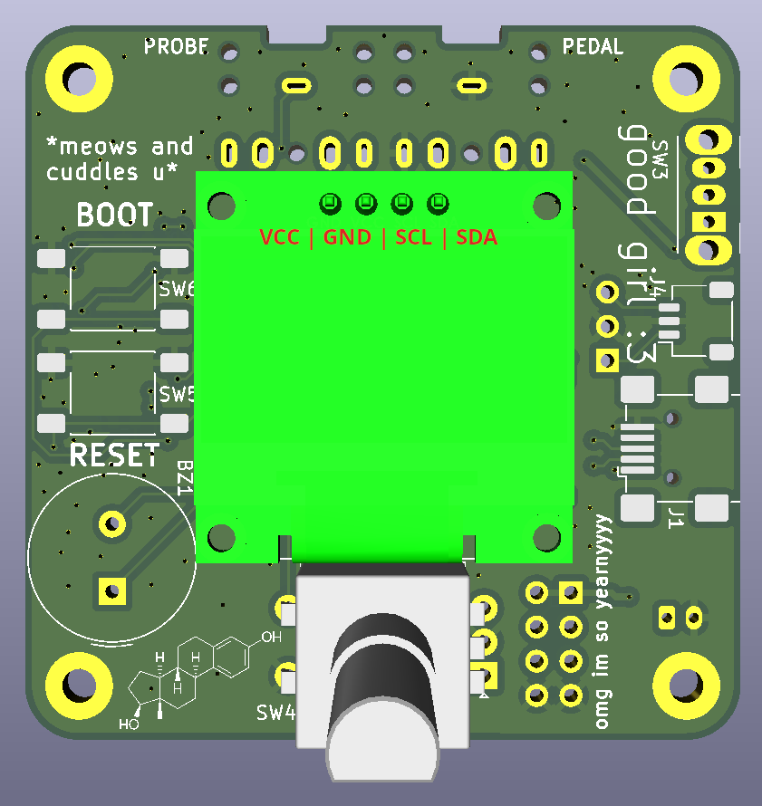

# Complete the PCB: THT Soldering & Display Connection

Now it gets hands-on! Don't worry, it's easier than it looks.

## Tool Checklist

You'll need:

- ✅ **Soldering iron** ($30–50 is enough, e.g., "Weller" or "Hakko")
- ✅ **Solder** (with flux core, 0.75mm)
- ✅ **Wire cutters** (for excess leads)
- ✅ **Screwdriver** (small Phillips)
- ✅ **Second person** (helps with holding, optional)

---

## Step 1: Soldering THT Components

**THT = Through-Hole Technology** (components that go through holes in the board).

### Order (always from flattest to tallest):
1. **Resistors** (sit flat on the board)
2. **Capacitors** (if not SMD)
3. **Sockets** (USB-C, 6.35mm jack)
4. **Switches** (tactile buttons)
5. **Display** (last, since it's the tallest)

### Soldering Guide for Beginners
1. **Insert the component** through the holes.
2. **Bend the leads** slightly apart (holds the part in place).
3. **Heat the hole** with the soldering iron (2–3 seconds).
4. **Apply solder** (not too much — a small "connection island" is enough).
5. **Remove the iron** and wait for the solder to solidify (1–2 seconds).
6. **Cut excess leads** with wire cutters.

---

## Step 2: Connecting the Display

The OLED display is usually soldered with **pin headers**.

### Check the Pinout!
Typical order (left to right, display facing you, pins pointing up):
1. **VCC** (power +3.3V or +5V)
2. **GND** (ground)
3. **SCL** (I2C clock)
4. **SDA** (I2C data)

!!! warning "Caution: Pin order varies!"
    Some displays have a different pin order!  
    Check the datasheet or do a **multimeter continuity test**.

{width=400 loading=lazy}
*Figure: Display pins on the PCB (VCC, GND, SCL, SDA)*

### Connecting the Display

The display is soldered to the PCB using **pin headers** — match VCC to VCC, GND to GND, SCL to SCL, SDA to SDA. The labeled image above shows exactly where each pin goes.

---

## Troubleshooting

| Problem | Cause | Solution |
|---------|-------|----------|
| Display stays black | Wrong pinout | Check datasheet, swap pins |
| Foot pedal doesn't respond | Cold solder joint | Re-solder the connection |
| Device won't start | USB-C cable faulty | Try a different cable |
| Current too high | Wrong calibration | See [Calibration](calibration.md) |

---

**Next chapter:** [3D Printing: All Plastic Parts](3d-printing.md)
